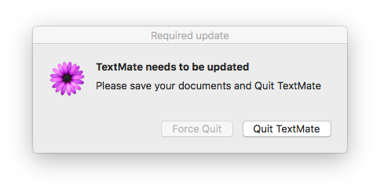

# MacAdmin Quit App

MacAdminQuitApp presents the user a dialog box that asks him to quit an application.
The user can click on "Quit [Application]". After five seconds, the button "Force Quit" will be enabled.



## Configuration

MacAdminQuitApp expects two configuration items:
- *appPath*: Path to an Application (eg. "/Applications/Microsoft Excel.app") (REQUIRED)
- *appBundleID*: any part of the bundle ID (eg. "com.citrix") (OPTIONAL)

appBundleID is meant to kill agents and daemons.

to supply this configuration, you can use:
- Configuration Profiles
- `defaults` command
- command-line: `-appPath "/Applications/Microsoft Excel.app" -appBundleID ""`

## How to use

### Embed in a package

Easiest way for small updates (such as preferences).

Create two folders, ROOT and scripts. In ROOT the files that will be installed (eg. "Library/Application Support/test.txt"). In scripts, embed MacAdminQuit.App and create a postinstall script with the following content:

```bash
#!/bin/bash

MacAdminQuitApp.app/Contents/MacOS/MacAdminQuitApp \
    -appPath "/Applications/Citrix Receiver.app" \
    -appBundleID "com.citrix."

```

Then create a package using the following command:
`pkgbuild --root ROOT --identifier io.fti.test --version 1.0 --scripts scripts test.pkg`

